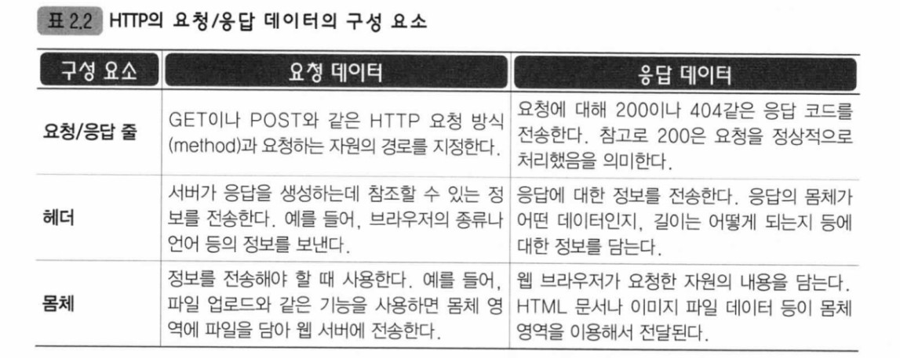

### JSP란?
> 웹브라우저 -> http요청 -> was(서버)  
> 웹브라우저 <- http응답 <- was(서버)  
- 위의 과정에서, 서버가 응답으로 보내줄 내용이 정적자원 뿐이라면 JSP도 필요없고 was도 필요없음! html과 webServer만으로 ok
- 하지만 동적자원이 등장하면 JSP와 was가 필요함!
- 동적자원 : 파일을 바꾸지 않아도 조건에 따라 응답데이터가 달라지는 자원을 말함
- JSP : 동적페이지를 작성하는데 사용되는 자바의 표준기술 (기본적으로 HTML)
- WAS : 웹브라우저로부터 요청이 오면 알맞은 프로그램을 찾아 실행하고, 그 결과를 응답으로 전송

### JSP 구성요소
- 스크립트 : 페이지의 동적데이터 생성 (3개)
  - <% : JSP에 JAVA소스코드 삽입
  - <%= : toString
  - <%! : 메소드 만들기. 디렉티브 밑에다가 써야함!
- 지시어(디렉티브) : JSP설정 (3개)
  - <%@ page 
  - <%@ tablib : 태그 라이브러리 선언
- 내장객체 : JSP컨테이너에 의해 선언없이도 바로 사용할 수 있는 자바객체 (9개)
  - request : 클라이언트 -> 서버
  - response : 서버 -> 클라이언트
  - out : 출력 to 클라이언트
  - session : 서버측 사용자 상태관리
  - application : 어플리케이션 전반에 걸친 정보관리
- 표현언어(Expression language, EL)
  - 스크립트 대신 쓰는 태그기반의 새로운 언어 -> ${ 내용 } 기본꼴
- JSTL : EL로 안되는 조건문 반복문은 태그로 구현할 수 있게~
  - <c:if>, <c:choose>, <c:when>, <c:otherwise> 등등

### JSP 쓰기위한 사전작업
- Eclipse 4.16-2020.06-Eclipse IDE for Enterprise Java Developers 다운받기
- Enterprise Edition으로 가야 tools for Web Services가 내장되어있음
- 서버 경로 톱캣으로 설정
  - window -> show view -> servers 또는 console창에서 server탭 클릭
  - create new server -> appache -> 톰캣9버전 -> browse해서 tomcat경로 찾아감
  - 이제 server탭에서 run하면 tomcat이 실행됨~!!
- 프로젝트 생성
  - 우클릭 -> dynamic web project
  - project명과 context root명을 다르게 가능! context root는 웹주소쓸때 필요한 파트니깐 기억해두기~  
  -> 혹시 context root를 변경하고자하면 프로젝트 우클릭 -> properties -> web project setting ㄱㄱ  
  - WEB-INF안의 web.xml에는 웹어플리케이션 설정이 들어있음 & 이 폴더 안에 넣은 jsp는 ★사용자에게서 감춰짐!
  - web.xml은 해당 프로젝트에서 우클릭 -> Java EE Tools -> Generate Deployment~하면 생성됨
  - 동적리소스는 물론, html문서(정적리소스) 만드는 것도 가능!
- 배포
  - export-war file -> destination을 톰캣의 webapps로 -> tomcat start.bat하고 웹에서 실행
  
### JSP 실전!
  - [변경되는 시간을 포함 할 수 있는 페이지 만들기](../ee/220805/WebContent/time.jsp)
    > 1. js이용하기 : 클라이언트 사이드 렌더링  
	> 2. servlet/jsp사용하기 (서버에서 부터 변경된 시간 보여주기) : 서버 사이드 렌더링  
	>   -> 장점! 서버에만 존재하는 자원으로 자유롭게 활용가능  
    - jsp를 실행하면, tomcat의 webapps폴더에 그 jsp가 있는것처럼 작동(실제 tomcat에는 올라가있지 않다!)
  - [JSP의 스크립트를 이용해 합계구하기](../ee/220805/WebContent/sum.jsp)
  - [클라이언트가 요청할 수 있는 페이지 만들기](../ee/220805/WebContent/form.jsp)
    - form의 action 어트리뷰트 : 정보 이동할 경로
	- form의 method 어트리뷰트 : 어떤방식으로 요청을 만들것인가 get/post
	  - get : body가 없고 parmeter가 사용자가 요청한 주소에 붙음  
	  - post : 주소가 아닌 body에 사용자의 요청 정보가 담김(요청 정보 길이 = body의 길이값)
	  - [각 방식에서의 인코딩?](./encoding.md)
  - [JSP의 request객체 이해하기](../ee/220805/WebContent/requestInfo.jsp)
    - 클라이언트의 요청을 http프로토콜에 따라 header와 body로 담아 보내면 그걸 request객체로 톰캣이 만듬
	- `.getParameter("name값")` : name에 입력값이 하나일 때
	- `.getParameterValues("name값")` : name에 입력값이 여러개일 때
	- `.getParameterMap()` : set된 모든 파라미터를 <name, 입력값s> 형태로 넣어서 map으로 반환
  - request에 대한 response역시 header(코드: 200은 ok, 404은 사용자측 에러, 503은 서버측 에러)와  
	body(html문서 등등을 담음)로 나뉘어서 옴
	
----
> JSP vs 서블릿 : https://javacpro.tistory.com/43  
> JSP 구성요소 : https://javacpro.tistory.com/44?category=104808  
